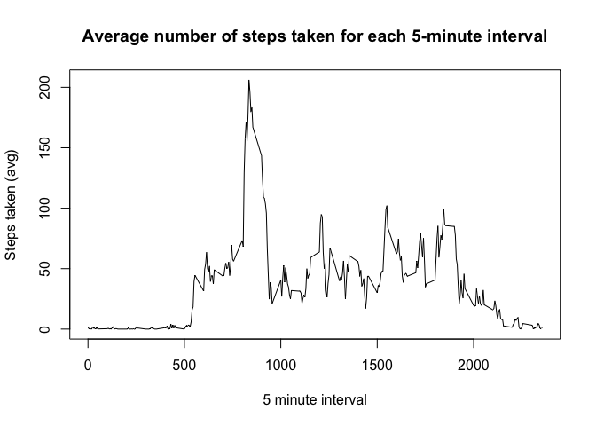
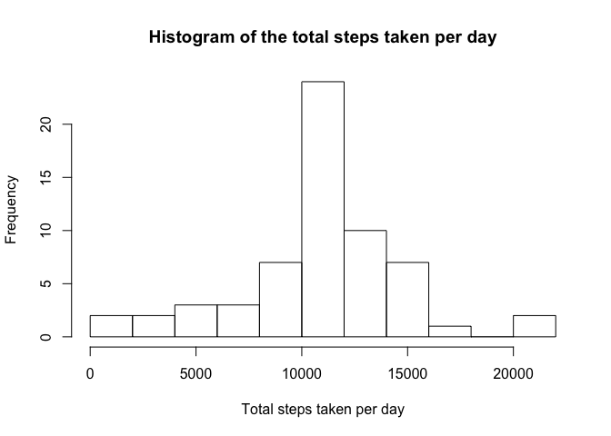
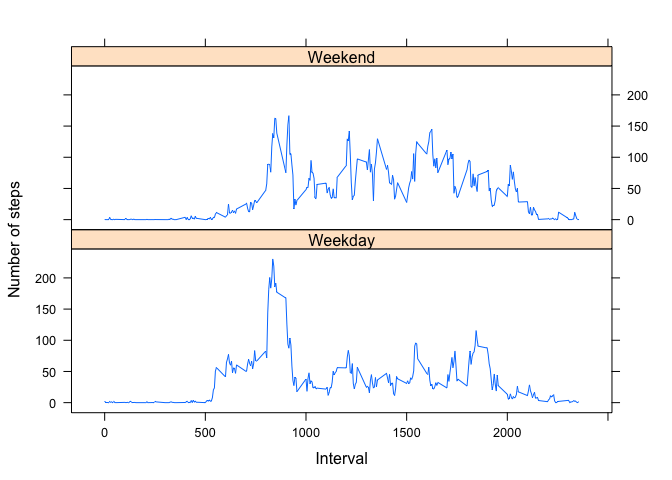

## Load packages

```r
library(knitr)
opts_chunk$set(echo = TRUE)
library(lattice)
```

## Loading and preprocessing the data
### 1. Load the data

```r
if(!file.exists('activity.csv')){
    unzip('activity.zip')
}
data <- read.csv("activity.csv", header = TRUE)
```
### 2. Transform the data into a suitable format for analysis

Take a look at the contents of the `data` dataset.

```r
head(data)
```

```
##   steps       date interval
## 1    NA 2012-10-01        0
## 2    NA 2012-10-01        5
## 3    NA 2012-10-01       10
## 4    NA 2012-10-01       15
## 5    NA 2012-10-01       20
## 6    NA 2012-10-01       25
```

```r
dim(data)
```

```
## [1] 17568     3
```

```r
str(data)
```

```
## 'data.frame':	17568 obs. of  3 variables:
##  $ steps   : int  NA NA NA NA NA NA NA NA NA NA ...
##  $ date    : Factor w/ 61 levels "2012-10-01","2012-10-02",..: 1 1 1 1 1 1 1 1 1 1 ...
##  $ interval: int  0 5 10 15 20 25 30 35 40 45 ...
```
From the summary it is evident that `date` is a factor. So change the `date` into the required dateformat class.

```r
data$date <- as.Date(data$date)
str(data)
```

```
## 'data.frame':	17568 obs. of  3 variables:
##  $ steps   : int  NA NA NA NA NA NA NA NA NA NA ...
##  $ date    : Date, format: "2012-10-01" "2012-10-01" ...
##  $ interval: int  0 5 10 15 20 25 30 35 40 45 ...
```
Now the `data` dataset is ready for analysis.

* Note #1: Coding of interval names are 500 for 5:00 and 1000 for 10:00, and so on. 

* Note 2: There are a number of days/intervals where there are missing values are coded as `NA`. Missing values in the dataset are ignored for further analysis.


## What is mean total number of steps taken per day?
### 1. Total number of steps taken per day

```r
stepsDay <- aggregate(steps ~ date, data=data, sum)
```

Check the `stepsDay` dataset

```r
dim(stepsDay)
```

```
## [1] 53  2
```

```r
head(stepsDay)
```

```
##         date steps
## 1 2012-10-02   126
## 2 2012-10-03 11352
## 3 2012-10-04 12116
## 4 2012-10-05 13294
## 5 2012-10-06 15420
## 6 2012-10-07 11015
```

### 2. Histogram of the total number of steps taken each day

```r
hist(stepsDay$steps, main="Histogram of the total steps taken per day", xlab='Total steps taken per day', ylab='Frequency', breaks=14)
```

<!-- -->

### 3. Mean and median of the total number of steps taken per day

Compute the mean

```r
stepsDayMean <- mean(stepsDay$steps)
stepsDayMean
```

```
## [1] 10766.19
```

Compute the median

```r
stepsDayMedian <- median(stepsDay$steps)
stepsDayMedian
```

```
## [1] 10765
```


## What is the average daily activity pattern?
### 1. Time series plot of average number of steps taken for each 5-minute interval

```r
dayAvg <- aggregate(steps ~ interval, data=data, "mean")
```

Take a look at the `dayAvg` dataset.

```r
dim(dayAvg)
```

```
## [1] 288   2
```

```r
str(dayAvg)
```

```
## 'data.frame':	288 obs. of  2 variables:
##  $ interval: int  0 5 10 15 20 25 30 35 40 45 ...
##  $ steps   : num  1.717 0.3396 0.1321 0.1509 0.0755 ...
```

```r
head(dayAvg)
```

```
##   interval     steps
## 1        0 1.7169811
## 2        5 0.3396226
## 3       10 0.1320755
## 4       15 0.1509434
## 5       20 0.0754717
## 6       25 2.0943396
```

The `dayAvg` dataset not contains `288` 5 minute intervals with the corresponding average number of steps taken computed across two months. Now let us plot this data.

```r
plot(dayAvg$interval, dayAvg$steps, type="l",main="Average number of steps taken for each 5-minute interval", xlab='5 minute interval', ylab='Steps taken (avg)')
```

<!-- -->

### 2. Which 5-minute interval, on average across all the days in the dataset, contains the maximum number of steps?

```r
dayAvg[dayAvg$steps == max(dayAvg$steps),]
```

```
##     interval    steps
## 104      835 206.1698
```
So a maximum of `206` steps is recorded on an average at `8:35 AM`

## Imputing missing values

### 1. Calculate and report the total number of missing values in the dataset

```r
sum(is.na(data$steps))
```

```
## [1] 2304
```

### 2. Devise a strategy for filling in all of the missing values in the dataset
It is reasonable strategy to replace the missing values with 5-minute interval averages for steps taken.

### 3. Create a new dataset that is equal to the original dataset but with the missing data filled in
Create a new dataset `dataNew` which is a replica of `data` dataset.

```r
dataNew <- data
```

Now replace the NA values with the average values from `dayAvg` dataset

```r
for (i in 1:17568){
        if(is.na(data$steps[i])){
                dataNew$steps[i] <- dayAvg$steps[which(dayAvg$interval == dataNew$interval[i])]
        }
}
```

Examine the contents of `dataNew` dataset

```r
head(dataNew)
```

```
##       steps       date interval
## 1 1.7169811 2012-10-01        0
## 2 0.3396226 2012-10-01        5
## 3 0.1320755 2012-10-01       10
## 4 0.1509434 2012-10-01       15
## 5 0.0754717 2012-10-01       20
## 6 2.0943396 2012-10-01       25
```

```r
sum(is.na(dataNew$steps))
```

```
## [1] 0
```
Now all `NA` values have now been replaced in the `dataNew` dataset.

### 4. Make a histogram of the total number of steps taken each day and Calculate and report the mean and median total number of steps taken per day.

```r
stepsDayNew <- aggregate(steps ~ date, data=dataNew, sum)
```


```r
hist(stepsDayNew$steps, main="Histogram of the total steps taken per day", xlab='Total steps taken per day', ylab='Frequency', breaks=14)
```

<!-- -->
It is evident that the new histogram hasn't changed for `breaks=14`

Compute the new mean

```r
stepsDayMeanNew <- mean(stepsDayNew$steps)
stepsDayMeanNew
```

```
## [1] 10766.19
```

Compute the new median

```r
stepsDayMedianNew <- median(stepsDayNew$steps)
stepsDayMedianNew
```

```
## [1] 10766.19
```

### 5. Do these values differ from the estimates from the first part of the assignment? What is the impact of imputing missing data on the estimates of the total daily number of steps?

Compute the difference between the new and old mean

```r
stepsDayMeanNew - stepsDayMean
```

```
## [1] 0
```

Compute the difference between the new and old median

```r
stepsDayMedianNew - stepsDayMedian
```

```
## [1] 1.188679
```
There is no impact of missing data on the mean, but the median has shifted to the right by `1 step`.

## Are there differences in activity patterns between weekdays and weekends?

### 1. Create a new factor variable in the dataset with two levels - `weekday` and `weekend` indicating whether a given date is a weekday or weekend day


```r
dataNew$day <- factor(dataNew, levels = c("weekday", "weekend"))
dataNew$day <- ifelse((weekdays(as.Date(dataNew$date)) == "Saturday") | (weekdays(as.Date(dataNew$date)) == "Sunday"),"Weekend", "Weekday")
```

Examine the `dataNew` dataset

```r
str(dataNew)
```

```
## 'data.frame':	17568 obs. of  4 variables:
##  $ steps   : num  1.717 0.3396 0.1321 0.1509 0.0755 ...
##  $ date    : Date, format: "2012-10-01" "2012-10-01" ...
##  $ interval: int  0 5 10 15 20 25 30 35 40 45 ...
##  $ day     : chr  "Weekday" "Weekday" "Weekday" "Weekday" ...
```

```r
head(dataNew)
```

```
##       steps       date interval     day
## 1 1.7169811 2012-10-01        0 Weekday
## 2 0.3396226 2012-10-01        5 Weekday
## 3 0.1320755 2012-10-01       10 Weekday
## 4 0.1509434 2012-10-01       15 Weekday
## 5 0.0754717 2012-10-01       20 Weekday
## 6 2.0943396 2012-10-01       25 Weekday
```

### 2. Panel plot containing a time series plot of the 5-minute interval and the average number of steps taken, averaged across all weekday days or weekend days


```r
stepsWeek <- aggregate(steps ~ interval+day, data=dataNew, "mean")
xyplot(steps~interval | factor(day), data = stepsWeek, type="l", layout = c(1,2),xlab="Interval",ylab="Number of steps")
```

<!-- -->

